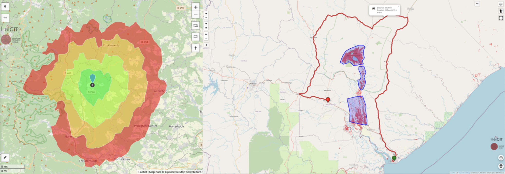

# 🚛 Distance Matrix Generator to Logistic Destinations

This project calculates **real-road distances and travel times** between origin polygons (agricultural fields) and destination points (ports, grain elevators, processing plants, etc.), using GIS data and a local OSRM routing server.



## 📋 Requirements

- **Docker**: Required to run the OSRM routing server
- **Python**: >= 3.11
- **uv**: Python dependency manager (recommended) or pip
- **Jupyter Notebook** or **VS Code** with Jupyter extension

## 🚀 Installation

### 1. Clone the repository

```bash
git clone Joaquin-Urruti/osrm-local-server
cd distancias_destinos_localserver
```

### 2. Install Python dependencies

**Using uv (recommended):**
```bash
uv sync
```

**Using pip:**
```bash
pip install -r requirements.txt
```

Key dependencies:
- `geopandas`: GIS data manipulation
- `osmnx`: OpenStreetMap network analysis and road network snapping
- `pandas`: Data processing
- `requests`: HTTP requests to OSRM server
- `openpyxl`: Excel file export

### 3. Start the OSRM routing server

Run the initialization script to download OSM data for Argentina and start the local OSRM server:

```bash
./iniciar_server_osrm_docker.sh
```

This script will:
- Download Argentina OSM data (~400 MB) from Geofabrik if not present
- Process the road network data (extract, partition, customize)
- Start the OSRM server in a Docker container on an available port (starting from 5000, default: 5001)

**Note**: The first run takes several minutes to process the OSM data. Subsequent runs are much faster.

### 4. Verify OSRM server is running

```bash
docker ps -f name=osrm
```

You should see a container named `osrm` running.

## 📁 Input Data Structure

Place your input files in the `inputs/` directory:

### Required files:

1. **`origenes.gpkg`** (or `origenes.shp`): Polygon layer of agricultural fields
   - **Required columns**:
     - `idest`: Field identifiers (string)
     - `campania`: Campaign/season identifier (e.g., "24/25")
     - `zona`: Geographic zone name (string)
     - `geometry`: Polygon geometries
   - Coordinate system: Any CRS (will be converted to EPSG:4326)

2. **`destinos.gpkg`** (or `destinos.shp`): Point layer of logistic destinations
   - **Required columns**:
     - `Localidad`: Destination name (string)
     - `geometry`: Point geometries
   - Coordinate system: Any CRS (will be converted to EPSG:4326)

## 🏃 Usage

### Run the distance calculation

Open and execute the notebook [distancias_table.ipynb](distancias_table.ipynb) in Jupyter or VS Code.

The notebook performs the following steps:

1. **Load and filter data**:
   - Reads origin polygons from `inputs/origenes.gpkg` or `inputs/origenes.shp`
   - Filters by campaign season (default: `'24/25'`)
   - Optionally filters by zone (e.g., `'LA PAMPA'`)
   - Creates a mapping dictionary `origen_zona` linking field IDs to their zones

2. **Process geometries**:
   - Applies a small buffer (0.0001) to handle potential geometry issues
   - Dissolves multi-polygon fields by `idest` to create single geometries per field
   - Extracts centroids for each field
   - Converts coordinates to WGS84 (EPSG:4326)
   - Saves centroids to `inputs/centoids.gpkg` for reference

3. **Snap to road network**:
   - Uses `osmnx` to download the OSM road network for the region (based on input data bounds)
   - Snaps field centroids to nearest OSM road nodes using `ox.distance.nearest_nodes()`
   - Ensures routing starts from actual road locations

4. **Calculate distance matrix**:
   - Uses OSRM **Table Service** for efficient batch distance/duration calculation
   - Builds a single API request with all origins and destinations
   - Queries `http://localhost:5001` (default port, configurable in `build_distance_table()`)
   - Returns both distance (km) and duration (hours) for all origin-destination pairs
   - **More efficient** than individual Route Service calls for matrices

5. **Export results**:
   - Saves distance matrix to `outputs/matriz_de_distancias_table_service.xlsx`

### Output format

The output Excel file contains:

| Column | Description |
|--------|-------------|
| `zona` | Geographic zone |
| `idest` | Field identifier |
| `origen_x` | Origin longitude |
| `origen_y` | Origin latitude |
| `destino` | Destination name |
| `destino_x` | Destination longitude |
| `destino_y` | Destination latitude |
| `distancia_km` | Road distance in kilometers |
| `duracion_h` | Travel time in hours |

## 🧩 How It Works

### Architecture

1. **OSRM Server** (Docker container):
   - Provides high-performance routing based on OpenStreetMap data
   - Uses preprocessed road network data for Argentina (`argentina-latest.osrm.*` files)
   - Exposes Table Service API for batch distance/duration calculations
   - Runs locally to ensure privacy and avoid API rate limits

2. **Data Processing** (Jupyter notebook):
   - **GeoPandas**: Spatial data loading, manipulation, and CRS transformations
   - **OSMnx**: Downloads OSM road network graph and snaps centroids to nearest nodes
   - **OSRM Table Service**: Single API call to compute full O(n×m) distance/duration matrix
   - **Pandas**: Data manipulation and Excel export

### Key technical details

- **Coordinate system handling**:
  - Input data can be in any CRS (e.g., EPSG:22185, EPSG:5347)
  - All geometries are converted to EPSG:4326 (WGS84) for routing
  - OSRM expects coordinates in `lon,lat` format

- **Network snapping**:
  - Field centroids are snapped to the nearest OSM road node using `ox.distance.nearest_nodes()`
  - Ensures routing starts from actual road locations (not arbitrary points in fields)
  - Uses an OSM graph bounded by the input data extent

- **OSRM Table Service**:
  - Calculates all origin-destination pairs in a **single API call**
  - Much more efficient than individual Route Service calls for matrices
  - Returns both distances (meters) and durations (seconds)
  - Request format: `/table/v1/driving/{coords}?sources={indices}&destinations={indices}&annotations=distance,duration`

- **Port configuration**:
  - Default port is **5001** (hardcoded in notebook)
  - The initialization script finds the first available port starting from 5000
  - If server uses a different port, update the `base_url` parameter in `build_distance_table()`

- **Helper function**:
  - `build_distance_table()` encapsulates the entire OSRM Table Service logic
  - Parameters: origin coordinates, destination coordinates, zone mapping, profile (driving/bike/foot), base URL
  - Returns a long-format DataFrame ready for analysis

## 🔧 Configuration

### Filter by campaign and zone

Edit the notebook to change the campaign filter:
```python
espcul_gdf = espcul_gdf.loc[espcul_gdf.campania == '24/25']  # Change campaign here
```

Filter by specific zones:
```python
espcul_gdf = espcul_gdf.loc[espcul_gdf.zona.isin(['LA PAMPA', 'CORDOBA'])]  # Add/remove zones
```

### Change routing profile

The `build_distance_table()` function supports different routing profiles:
```python
df_od = build_distance_table(
    espcul_coord_snapped,
    origen_zona,
    destinos_coord,
    profile="driving"  # Options: "driving", "bike", "foot"
)
```

### Use public OSRM server (not recommended)

If you don't want to run a local server, you can use the public OSRM instance:
```python
df_od = build_distance_table(
    espcul_coord_snapped,
    origen_zona,
    destinos_coord,
    base_url="http://router.project-osrm.org"
)
```

**⚠️ Warning**: Public server has rate limits and may be slower. Use only for testing.

## 🛠️ Troubleshooting

### OSRM server not responding

Check if the container is running:
```bash
docker ps -f name=osrm
```

View logs:
```bash
docker logs osrm
```

Restart the server:
```bash
docker stop osrm && docker rm osrm
./iniciar_server_osrm_docker.sh
```

### Wrong port configuration

If the OSRM server is running on a port other than 5001, find the correct port:
```bash
docker ps -f name=osrm
```

Update the `base_url` parameter in the notebook:
```python
df_od = build_distance_table(
    espcul_coord_snapped,
    origen_zona,
    destinos_coord,
    base_url="http://localhost:5000"  # Change port here
)
```

### Missing columns in input data

Ensure your input files have all required columns:
- `origenes.gpkg`: `idest`, `campania`, `zona`, `geometry`
- `destinos.gpkg`: `Localidad`, `geometry`

### Coordinate warnings

If you see UserWarnings about "geographic CRS" (buffer, centroid operations), these are expected and can be ignored. The code handles coordinate system conversions internally.

### OSMnx network download issues

If OSMnx fails to download the road network:
- Check your internet connection
- Verify the bounding box is correct (printed in console)
- Try reducing the area by filtering fewer zones

### OSRM Table Service errors

If you get "OSRM table error: NoRoute" or similar:
- Check that coordinates are within Argentina (or the OSM data region)
- Verify that centroids were correctly snapped to the road network
- Some remote locations may not have connected roads in OSM

## 📊 Example Use Cases

- Calculate distances from agricultural fields to grain elevators
- Optimize logistics routes for harvest transportation
- Analyze accessibility of different production zones to ports
- Compare travel times to multiple destination options
- Generate cost matrices for transport planning

## 📝 Project Structure

```
distancias_destinos_localserver/
├── inputs/
│   ├── origenes.gpkg         # Origin polygons (agricultural fields)
│   ├── destinos.gpkg         # Destination points (ports, elevators, etc.)
│   └── centoids.gpkg         # Generated centroids (intermediate file)
├── outputs/
│   └── matriz_de_distancias_table_service.xlsx  # Final distance matrix
├── argentina-latest.osrm.*   # Preprocessed OSRM files (generated by init script)
├── distancias_table.ipynb    # Main notebook (uses OSRM Table Service)
├── iniciar_server_osrm_docker.sh  # Server initialization script
├── pyproject.toml            # Python dependencies (uv)
└── README.md                 # This file
```

## 🤝 Contributing

This project is maintained for internal use at Espartina. 
For questions or issues, contact the development team.