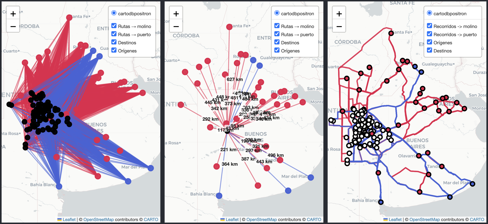

# 🚛 Distance Matrix Generator to Logistic Destinations

This project calculates **real-road distances** between origin and destination point layers using GIS data and a local OSRM routing server.



## 📋 Requirements

- **Docker**: Required to run the OSRM routing server
- **Python**: >= 3.11
- **uv**: Python dependency manager (recommended) or pip
- **Jupyter Notebook** or **VS Code** with Jupyter extension

## 🚀 Installation

### 1. Clone the repository

```bash
git clone git clone https://github.com/Joaquin-Urruti/osrm-local-server
cd osrm-local-server
```

### 2. Install Python dependencies

**Using uv (recommended):**
```bash
uv sync
```

**Using pip:**
```bash
pip install -r requirements.txt
```

Key dependencies:
- `geopandas`: GIS data loading and geometry processing
- `pandas`: Data processing
- `requests`: HTTP requests to the OSRM server
- `openpyxl`: Excel export
- `pyyaml`: Settings and destinations config

### 3. Start the OSRM routing server

Run the initialization script to download OSM data for Argentina and start the local OSRM server:

```bash
./init_server_osrm_docker.sh
```

This script will:
- Download Argentina OSM data (~400 MB) from Geofabrik if not present
- Process the road network data (extract, partition, customize)
- Start the OSRM server in a Docker container on the first available port (starting from 5000)
- Write the chosen port to `config/osrm_port.txt` (Python reads it automatically)

**Note**: The first run takes several minutes to process the OSM data. Subsequent runs are much faster.

### 4. Verify OSRM server is running

```bash
docker ps -f name=osrm
```

You should see a container named `osrm` running.

## 📁 Input Data Structure

Place your input files in `inputs/`. User data stays local (see `inputs/.gitignore`); example fixtures are versioned for testing.

### Origins

- One origin layer file (`.gpkg`, `.shp`, `.xlsx`, `.geojson`, etc.).
- Polygon geometries are converted to point centroids; point layers are used as-is.
- The origin file path and the column used as the unique identifier are set in `config/settings.yaml`.
- When you run the pipeline, the normalized origin layer is saved as `inputs/origin_centroids.geojson` (alongside `inputs/destinations.geojson` for destinations).

### Destinations

- One or more destination layers, defined in `inputs/destinations.yaml`.
- Copy the template and edit:

```bash
cp inputs/destinations.example.yaml inputs/destinations.yaml
```

Each entry in `destinations` needs:

| Field | Required | Description |
|-------|----------|-------------|
| `path` | yes | File inside `inputs/` (`.gpkg`, `.shp`, `.geojson`, etc.) |
| `layer` | for multi-layer `.gpkg` | Layer name inside the file |
| `type` | yes | Logical destination type label (e.g. `port`, `mill`, `laboratory`) |
| `name_col` | yes | Column used as the destination name |

Each destination gets a composite id: `{type}_{name}` (e.g. `port_Bahia Blanca`, `mill_Tandil`).

Example:

```yaml
destinations:
  - path: ports.geojson
    type: port
    name_col: name
  - path: destinations.gpkg
    layer: mills
    type: mill
    name_col: name
  - path: laboratories.geojson
    type: laboratory
    name_col: name
```

## 🏃 Usage

There are two ways to run the pipeline: the CLI (recommended for a full batch run) or the notebook (for interactive exploration).

### Option A: CLI

The project installs a `distances` command (entry point `distances.cli:main`):

```bash
uv run distances matrix
uv run distances matrix --settings config/settings.yaml --output outputs/distance_matrix.xlsx
```

Equivalent module / script forms:

```bash
uv run python -m distances matrix
uv run python main.py matrix
```

The `matrix` command reads `config/settings.yaml`, loads and normalizes origin and destination layers, snaps coordinates to the road network, and computes driving distances for all origin–destination pairs via the local OSRM server.

### Option B: Notebook

Open and execute [notebooks/example.ipynb](notebooks/example.ipynb) in Jupyter or VS Code. The notebook imports helpers from the `distances` package (`load_settings`, `snap_to_road`, `get_driving_distance`) and can be extended with your own filtering or post-processing steps before export.

### Output format

The CLI writes an Excel file with one row per origin–destination pair, sorted by origin, destination type, and proximity rank.

| Column | Description |
|--------|-------------|
| `orig_id` | Origin identifier (from the column configured in settings) |
| `orig_x` | Origin longitude (snapped to road network) |
| `orig_y` | Origin latitude (snapped to road network) |
| `dest_id` | Destination identifier (`{type}_{name}`) |
| `dest_x` | Destination longitude (snapped to road network) |
| `dest_y` | Destination latitude (snapped to road network) |
| `dist_km` | Road distance in kilometers (integer) |
| `type_dest` | Destination type label (prefix of `dest_id`, e.g. `port`, `mill`) |
| `proximity` | Rank by distance within each `(orig_id, type_dest)` group; `1` = closest |

**Proximity ranking:** for each origin and destination type, rows are ranked by `dist_km` ascending. Use `proximity` to keep only the *N* nearest destinations per origin and type—for example, `proximity <= 3` returns the three closest ports for each origin.

```python
# Top 2 closest destinations of each type, per origin
nearest = results[results["proximity"] <= 2]
```

## 🧩 How It Works

### Architecture

1. **OSRM server** (Docker container):
   - Routing based on preprocessed OpenStreetMap data
   - Runs locally (`osrm/argentina-latest.osrm.*` after the init script)
   - Host and port come from `config/settings.yaml` and `config/osrm_port.txt`

2. **`distances` package** (`src/distances/`):
   - `inputs.py` — load origin/destination layers, normalize to points (EPSG:4326)
   - `osrm.py` — snap to nearest road (`/nearest`) and driving distance (`/route`)
   - `matrix.py` — orchestrate the full origin–destination matrix
   - `cli.py` — `distances matrix` entry point

### Key technical details

- **Coordinate handling**: any input CRS is reprojected to EPSG:4326; OSRM expects `lon,lat`.
- **Geometry normalization**: polygons are validated and reduced to centroids in a projected CRS before export to WGS84.
- **Road snapping**: origin and destination coordinates are snapped via OSRM `nearest` before routing.
- **Distance calculation**: one OSRM Route request per origin–destination pair; distances returned in kilometers.
- **Port configuration**: `init_server_osrm_docker.sh` picks the first free port from 5000 and writes it to `config/osrm_port.txt`; Python reads that file automatically.

## 🔧 Configuration

### Project settings (`config/settings.yaml`)

Copy the example and edit for your environment:

```bash
cp config/settings.example.yaml config/settings.yaml
```

Example:

```yaml
osrm:
  host: localhost
  port: 5000  # fallback only; overridden by config/osrm_port.txt when present

defaults:
  origin_layer: inputs/test_origins.xlsx
  origin_id_col: id
  destinations_config: inputs/test_destinations.yaml
```

| Setting | Description |
|---------|-------------|
| `origin_layer` | Path to the origin layer file (relative to project root) |
| `origin_id_col` | Column with unique origin identifiers |
| `destinations_config` | Path to the destinations YAML config |

When you run `./init_server_osrm_docker.sh`, the chosen port is written to `config/osrm_port.txt` and read automatically by the package (overrides `osrm.port` in settings).

Destination layers are defined in `inputs/destinations.yaml` (use `inputs/test_destinations.yaml` for the bundled test fixtures).

## 🛠️ Troubleshooting

### OSRM server not responding

Check if the container is running:
```bash
docker ps -f name=osrm
```

View logs:
```bash
docker logs osrm
```

Restart the server:
```bash
docker stop osrm && docker rm osrm
./init_server_osrm_docker.sh
```

### Wrong port configuration

Check which port the container is using:

```bash
docker ps -f name=osrm
```

The port is written to `config/osrm_port.txt` when the server starts. Restart the init script if the file is missing or stale:

```bash
./init_server_osrm_docker.sh
```

### Missing or invalid input data

- Ensure `config/settings.yaml` exists and points to valid files.
- Ensure `inputs/destinations.yaml` exists (copy from `inputs/destinations.example.yaml`).
- The origin identifier column must exist in the origin layer and have unique values.
- Each destinations entry must include `path`, `type`, and `name_col`.

### OSRM routing errors

If distances come back as `-9999` or snap fails silently:
- Confirm the OSRM container is running and reachable at the configured host/port.
- Check that coordinates fall within the downloaded OSM region.
- Remote or disconnected road segments may not route successfully.

## 📝 Project Structure

```
osrm-local-server/
├── config/
│   ├── settings.example.yaml  # Template for project settings
│   ├── settings.yaml          # User settings (copy from example)
│   └── osrm_port.txt          # Written by init_server_osrm_docker.sh
├── inputs/
│   ├── .gitignore            # Keeps folder; ignores user data, versions fixtures
│   ├── destinations.example.yaml  # Template for destination layers config
│   ├── destinations.yaml     # User config (copy from example)
│   └── …                     # Your origin/destination layers (ignored by git)
├── outputs/
│   ├── .gitignore            # Keeps folder in repo; ignores generated files
│   └── distance_matrix.xlsx  # Generated output (ignored by git)
├── osrm/                     # OSM/OSRM data files (downloaded & generated by init script)
│   ├── argentina-latest.osm.pbf   # Raw OSM data (downloaded from Geofabrik)
│   └── argentina-latest.osrm.*    # Preprocessed OSRM files (generated by init script)
├── src/distances/            # Python package
│   ├── __init__.py           # Public API
│   ├── __main__.py           # python -m distances
│   ├── cli.py                # CLI entry point (command: matrix)
│   ├── settings.py           # Paths + load_settings()
│   ├── osrm.py               # snap_to_road(), get_driving_distance()
│   ├── inputs.py             # Read/normalize input layers
│   └── matrix.py             # build_distance_matrix()
├── notebooks/
│   ├── .gitignore            # Keeps folder; only example.ipynb is versioned
│   └── example.ipynb         # Exploratory notebook (imports the package)
├── main.py                   # Thin wrapper -> distances.cli:main
├── init_server_osrm_docker.sh  # Server initialization script
├── pyproject.toml            # Python dependencies + package config (uv)
└── README.md                 # This file
```

## 🤝 Contributing

This project is maintained by Joaquín Urruti. 
For questions or issues you can contact me on LinkedIn.